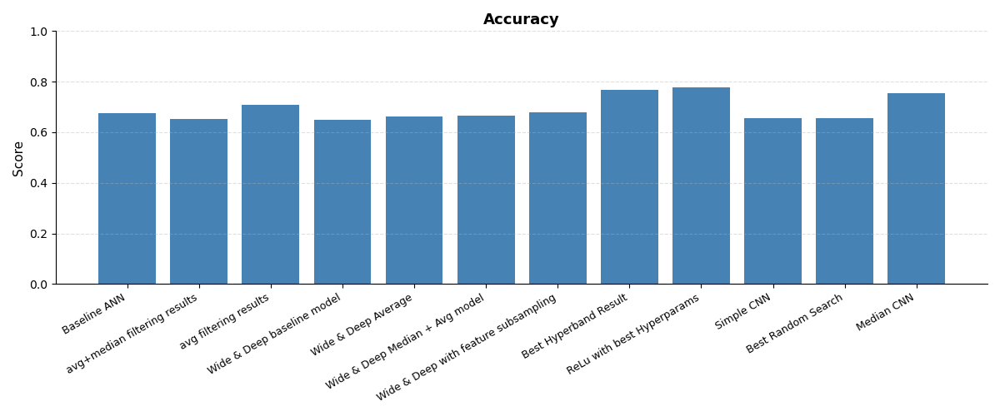
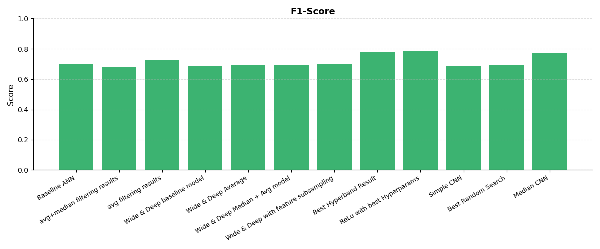
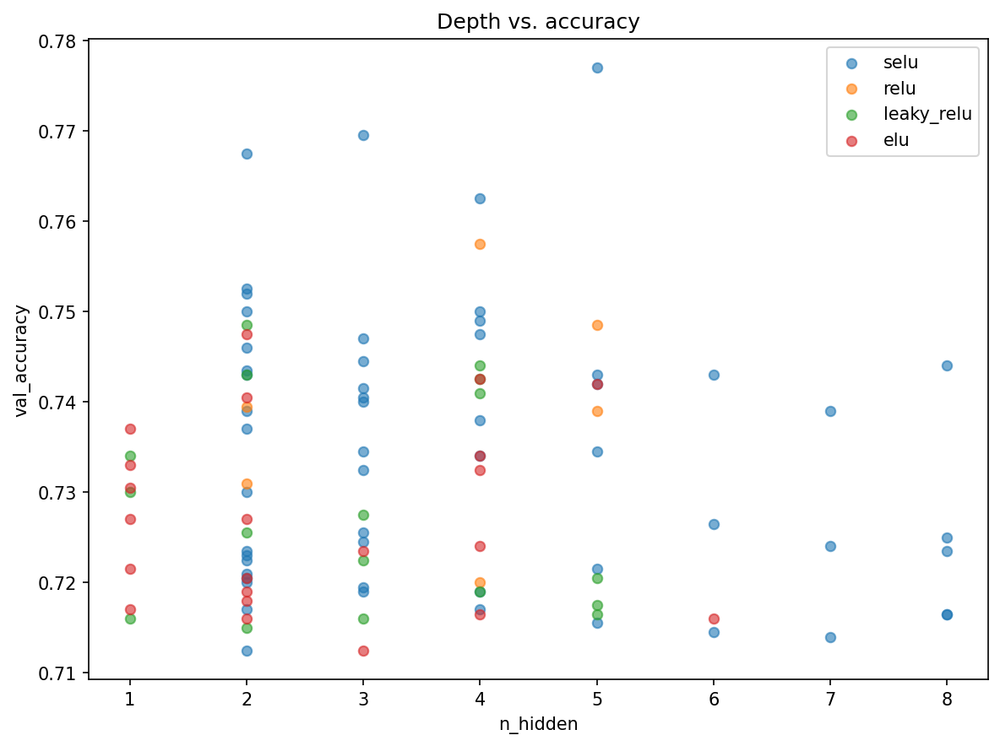

# Retinal Disease Classification from OCT Images

**BME 4810/6810 Final Project** — Samuel Schultz (with Himanshu Thakur)

Classifying retinal optical coherence tomography (OCT) scans into four diagnostic
categories, comparing classical ML ensembles against deep networks on the
**OCT-MNIST** dataset (~109,000 labeled images).

---

## Problem

Optical coherence tomography images the retina by measuring dim red light
reflected off the retina and optic nerve. Reading these scans by hand is slow and
requires a specialist. The goal here is to automatically sort a 28×28 grayscale
OCT scan into one of four classes:

| Label | Condition |
|-------|-----------|
| 0 | Normal |
| 1 | Choroidal neovascularization (CNV) |
| 2 | Diabetic macular edema (DME) |
| 3 | Drusen |

The dataset is large (~109k images) and class-imbalanced, so the challenge is
getting good per-class performance without simply predicting the majority class.

## Approach

Two families of models were built and tuned, all evaluated on the held-out test
set using accuracy (weighted recall), weighted precision, and weighted F1.

**Preprocessing / dimensionality reduction explored** (`utils.py`): 2×2 average &
max pooling, 3×3 median filtering for denoising, hand-crafted summary-statistic
features, PCA, and TruncatedSVD — all benchmarked against a `LinearSVC` baseline.

**Six candidate models** (`SS_BME_Presentation/models.py`, `final_report_notebook.ipynb`):

1. **Preprocessed Stacking** — median filter + avg-pool → Random Forest + RBF-SVC, combined by logistic regression
2. **Soft Voting** — Random Forest + SVC + AdaBoost on raw pixels
3. **SVD Soft Voting** — TruncatedSVD → SVC + SGD + Bagging
4. **Wide & Deep** — Keras network with PCA features fed to the wide path (Keras-Tuner random search)
5. **CNN** — convolutional net on median-filtered images
6. **ResNet** — residual network tuned with Keras-Tuner **Hyperband**

Hyperparameters were tuned with random search and Hyperband; class imbalance was
handled with balanced sample weights.

## Results

**The tuned ResNet was the best model, reaching ~0.78 accuracy and ~0.78 weighted
F1** — clearly ahead of the classical ensembles, which clustered around
0.65–0.73. The best classical result was the Preprocessed Stacking classifier
(0.725 accuracy). Deeper `selu` architectures gave the strongest validation
accuracy during tuning.

**Accuracy across all models**



**Weighted F1 across all models**



**Architecture tuning — validation accuracy vs. network depth and activation**



## Repository Layout

| Path | Contents |
|------|----------|
| `final_report_notebook.ipynb` | End-to-end pipeline: tuning → final test-set evaluation |
| `utils.py` | Preprocessing (pooling, median filter, feature gen) & training helpers |
| `SS_BME_Presentation/models.py` | Wide & Deep, CNN, and ResNet model builders |
| `milestone_1/2/3.ipynb` | Incremental milestone work |
| `Figures/` | All result plots and tuning charts |
| `octmnist.npz` | OCT-MNIST dataset |
| `Samuel_Schultz_BME_Final_Report.docx` | Full written report |

## Running It

```bash
pip install numpy scikit-learn tensorflow keras-tuner matplotlib pandas
jupyter notebook final_report_notebook.ipynb
```

The dataset (`octmnist.npz`) ships with the repo; run the notebook top to bottom
to reproduce tuning and the final test-set metrics.
